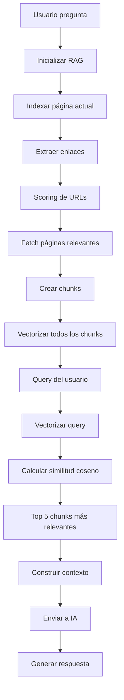

# 🔍 RAG Engine - Documentación

## ¿Qué es RAG?

**RAG** (Retrieval-Augmented Generation) es un sistema que combina recuperación de información con generación de texto mediante IA. En lugar de enviar todo el contenido de una página a la IA (lo cual puede exceder límites de tokens), el sistema:

1. **Vectoriza** el contenido en chunks (fragmentos)
2. **Busca** los chunks más relevantes según la pregunta
3. **Envía** solo los chunks relevantes a la IA
4. **Genera** una respuesta basada en información específica y relevante

## 🚀 Características del RAG Engine de WriteBee

### 1. **Vectorización Ligera con TF-IDF**

En lugar de usar embeddings complejos que requieren APIs externas, usamos **TF-IDF** (Term Frequency-Inverse Document Frequency):

- **Ventajas:**
  - ✅ Rápido y ligero
  - ✅ No requiere conexión a servicios externos
  - ✅ Funciona offline
  - ✅ Efectivo para búsqueda de texto
  
- **Cómo funciona:**
  - Tokeniza el texto (elimina stopwords, normaliza)
  - Calcula la frecuencia de términos (TF)
  - Calcula la frecuencia inversa de documentos (IDF)
  - Multiplica TF × IDF para obtener vectores
  - Usa similitud coseno para comparar

### 2. **Chunking Inteligente**

El contenido se divide en chunks de ~500 palabras con overlap de 100 palabras:

- **Overlap:** Asegura que el contexto no se pierda entre chunks
- **Tamaño óptimo:** 500 palabras es suficiente contexto sin ser demasiado largo
- **Metadatos:** Cada chunk mantiene información de su fuente (página actual vs página enlazada)

### 3. **Priorización de Contenido**

El sistema prioriza contenido según relevancia:

1. **Página actual:** Recibe un boost de 0.2 en similitud
2. **Páginas enlazadas:** Se procesan solo si son relevantes según la pregunta

### 4. **Análisis Inteligente de URLs**

El `URLScorer` analiza las URLs para determinar cuáles son más relevantes:

```javascript
// Ejemplo: Usuario pregunta "¿Cómo contactar a la empresa?"
// El sistema identifica que URLs con "contact", "contacto", "contactenos" son relevantes
// Si estás en la página inicial, priorizará /contacto o /contact
```

**Patrones reconocidos:**
- Contact/Contacto
- Products/Productos
- Services/Servicios
- Pricing/Precios
- About/Acerca
- Help/Ayuda
- Blog/News
- Careers/Trabajo

### 5. **Estrategia de Indexación Adaptativa**

- **Pocos enlaces (≤10):** Indexa hasta 3 enlaces relevantes
- **Muchos enlaces (>10):** Indexa hasta 5 enlaces más relevantes

Esto evita sobrecargar el sistema mientras mantiene buena cobertura.

## 📊 Flujo de Trabajo



## 💡 Casos de Uso

### Caso 1: Pregunta sobre página actual

**Usuario:** "Resume los puntos principales de esta página"

**Proceso:**
1. Indexa solo la página actual
2. Busca chunks con keywords: "main, key, important, principal"
3. Recupera top 8 chunks
4. Genera resumen

### Caso 2: Pregunta que requiere navegación

**Usuario:** "¿Cuáles son los precios de sus servicios?"

**Situación:** Estás en la página inicial

**Proceso:**
1. Indexa página actual
2. Extrae enlaces: `/servicios`, `/precios`, `/contacto`, `/blog`, etc.
3. URLScorer identifica `/precios` como más relevante (score alto)
4. Fetch y vectoriza `/precios`
5. Busca chunks relevantes en todas las páginas indexadas
6. La página actual recibe boost, pero si no tiene info, los chunks de `/precios` ganan
7. Genera respuesta con información de precios

### Caso 3: Pregunta con múltiples enlaces relevantes

**Usuario:** "¿Qué servicios ofrecen y cuánto cuestan?"

**Proceso:**
1. URLScorer identifica `/servicios` y `/precios` como relevantes
2. Fetch ambas páginas
3. Vectoriza todo el contenido
4. Recupera chunks de ambas páginas
5. Genera respuesta completa combinando información

## 🎯 Optimizaciones

### Performance

1. **Lazy Loading:** RAG solo se inicializa cuando se necesita
2. **Caching:** Una vez indexado, el contenido se reutiliza
3. **Límite de enlaces:** Evita indexar demasiadas páginas
4. **Chunks eficientes:** 500 palabras es el balance entre contexto y velocidad

### Precisión

1. **Boost de página actual:** Prioriza el contexto inmediato
2. **Overlap en chunks:** Mantiene contexto entre fragmentos
3. **Stopwords:** Filtra palabras comunes para mejor vectorización
4. **Normalización:** Minúsculas y limpieza de caracteres especiales

### Fallback

Si el RAG falla (error de red, permisos, etc.), el sistema:
1. Captura el error
2. Usa el método antiguo (enviar primeros 8000 caracteres)
3. No interrumpe la experiencia del usuario

## 🔧 API del RAG Engine

### Inicialización

```javascript
const rag = RAGEngine.getInstance();
await rag.indexPage(pageContent, metadata);
```

### Indexar Enlaces

```javascript
await rag.indexLinks(links, question, maxLinks);
```

### Búsqueda

```javascript
const chunks = rag.retrieve(query, topK);
```

### Construcción de Contexto

```javascript
const context = rag.buildContext(chunks);
```

### Limpieza

```javascript
rag.clear(); // Para nueva conversación
```

## 📈 Mejoras Futuras Potenciales

1. **Embeddings semánticos:** Usar modelos como Sentence Transformers para mejor comprensión
2. **Caché persistente:** Guardar índice en localStorage para sesiones futuras
3. **Re-ranking:** Segunda fase de ranking con modelos más sofisticados
4. **Hybrid search:** Combinar TF-IDF con búsqueda de keywords
5. **Análisis de estructura:** Usar headings y DOM para mejor chunking

## 🎓 Comparación: Antes vs Después

### Antes (Sin RAG)

```javascript
// Enviaba primeros 8000 caracteres (límite arbitrario)
const context = `Página: ${title}\nContenido: ${pageContent.substring(0, 8000)}`;
```

**Problemas:**
- ❌ Podía perder información importante al final
- ❌ No consideraba enlaces
- ❌ Enviaba mucho contenido irrelevante
- ❌ Limitado por tokens

### Después (Con RAG)

```javascript
// Busca los 5 chunks más relevantes (2500 palabras de información específica)
const chunks = rag.retrieve(question, 5);
const context = rag.buildContext(chunks);
```

**Ventajas:**
- ✅ Solo información relevante
- ✅ Considera enlaces relacionados
- ✅ Optimiza uso de tokens
- ✅ Respuestas más precisas

## 🌟 Conclusión

El RAG Engine de WriteBee ofrece un balance perfecto entre:

- **Simplicidad:** No requiere dependencias externas
- **Velocidad:** Procesamiento rápido con TF-IDF
- **Precisión:** Encuentra información relevante efectivamente
- **Escalabilidad:** Maneja páginas grandes y múltiples enlaces

Es una solución **ligera, rápida y efectiva** para chat con contenido web.
