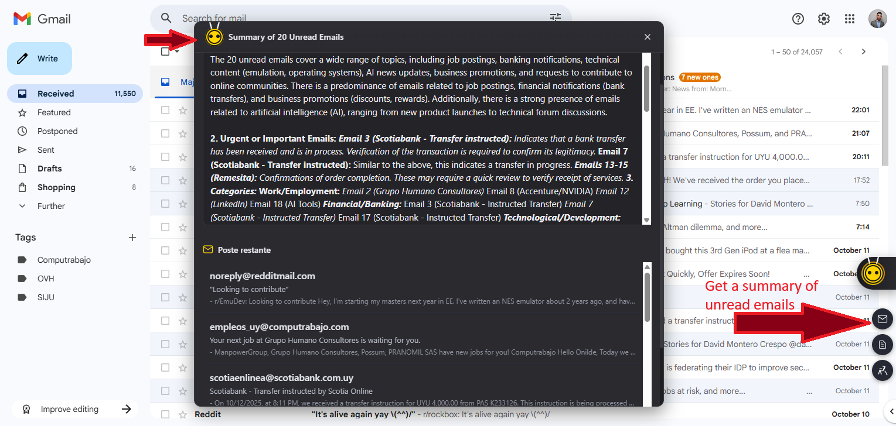

# WriteBee - AI Text Assistant

An intelligent Chrome extension that brings powerful AI capabilities directly to your browser. WriteBee enhances your web experience with on-device AI features for text processing, summarization, translation, and more.


## ✨ Features

### 🤖 AI-Powered Text Processing
- **Summarize** - Generate concise summaries of long texts
- **Translate** - Multi-language translation support
- **Rewrite** - Improve and rephrase text
- **Explain** - Get clear explanations of complex content
- **Grammar Check** - Fix grammar and spelling errors
- **Expand Text** - Add details and examples to your writing
- **Audio Recording** - Voice input for AI interactions


### 🎯 Platform-Specific Integrations

#### 📺 YouTube

- Automatic Video Summarization
- Hierarchical Chunking
- Progress Tracking
- Copy & Regenerate

#### 📧 Gmail



- Smart email composition assistance
- Quick reply suggestions
- Email summarization


#### 🐦 Twitter / X

- Tweet composition help
- Thread summarization
- Engagement optimization

#### 💼 LinkedIn


- Professional content assistance
- Post optimization
- Message drafting


#### 🐙 GitHub

- Repository summary
- Documentation help
- Issue and PR summarization

#### 🔍 Google Search


- Search result summarization
- Content analysis

#### 📄 PDF Support

- Extract and summarize PDF content
- Chat with PDF documents
- Translate PDF text

### 🎨 User Interface
- **Floating Toolbar** - Context-aware AI actions on any webpage
- **Side Panel** - Full-featured AI chat interface with prompt library
- **Prompt Library** - Reusable prompt templates for common tasks
- **Context Menus** - Right-click AI actions
- **Markdown Support** - Beautiful formatted output

## 🚀 Installation

### Requirements
- **Chrome Browser**: Version 138 or later
- **Operating System**:
  - Windows 10/11
  - macOS 13+ (Ventura and later)
  - Linux
  - ChromeOS (Chromebook Plus)
- **Storage**: At least 22 GB free space (for Gemini Nano model)
- **Memory**:
  - GPU Inference: 4+ GB VRAM
  - CPU Inference: 16+ GB RAM, 4+ cores
- **Network**: Unlimited or unmetered connection (for initial model download)

### Setup

1. **Clone or Download** this repository
   ```bash
   git clone https://github.com/yourusername/writebee.git
   ```

2. **Open Chrome Extensions**
   - Navigate to `chrome://extensions/`
   - Enable "Developer mode" (toggle in top right)

3. **Load the Extension**
   - Click "Load unpacked"
   - Select the `WriteBee` folder

4. **Initial Setup**
   - The extension will download the Gemini Nano model on first use
   - This may take some time depending on your connection
   - Monitor download progress in the extension popup

## 🛠️ Technology Stack

### AI APIs
- **Chrome AI APIs** (Built-in AI)
  - Summarizer API - Text summarization
  - Translator API - Multi-language translation
  - Language Model API - General AI prompts
  - Rewriter API - Text refinement
  - Writer API - Content generation
  - Language Detector API - Automatic language detection

### External APIs
- **YouTranscripts API** - YouTube video transcript extraction

### Core Technologies
- Vanilla JavaScript (ES6+)
- Chrome Extension Manifest V3
- DOMParser for XML/HTML processing
- Markdown rendering

## 📖 Usage

### Basic Text Actions


1. **Select Text** on any webpage
2. **AI Toolbar appears** with available actions
3. **Click an action** to process the text
4. **View results** in the side panel or inline

### YouTube Video Summaries

1. **Open any YouTube video** with subtitles
2. **Summary panel appears** automatically in the sidebar
3. **Summary generates automatically** (or click the button)
4. **View key points** in markdown format
5. **Copy or regenerate** as needed

### Side Panel Chat


1. **Click the extension icon** to open the side panel
2. **Type your question or request**
3. **Get AI-powered responses**
4. **Continue the conversation** with context

### Prompt Library

1. **Click the library icon** (book icon) in the chat input area
2. **Browse categorized prompts**:
   - **Text**: Summarize, Translate, Explain, Expand, Simplify
   - **Writing**: Make Professional, Make Casual, Write Email
   - **Formatting**: To Bullet Points
   - **Custom**: Your own saved prompts
3. **Search prompts** using the search box
4. **Click a prompt** to insert it into the chat
5. **Create custom prompts** with the "+ Add Custom Prompt" button
6. **Delete prompts** using the trash icon (appears on hover)

### Context Menu Actions


1. **Right-click** on selected text or images
2. **Choose an AI action** from the menu:   
   - Explain Image
   - Extract Text (OCR)
   - Process Image


## 🔧 Configuration


### Supported Languages
- English (en)
- Spanish (es)
- Japanese (ja)
- And more via Translator API

### Customization
- Adjust summary length (short, medium, long)
- Choose summary type (key-points, tldr, teaser, headline)
- Select output format (markdown, plain-text)

## 🎯 Advanced Features

### Prompt Library System
WriteBee includes a powerful prompt library that helps you work faster:

- **Pre-built Templates** - Ready-to-use prompts for common tasks
- **Categorized Organization** - Prompts organized by category (Text, Writing, Formatting)
- **Custom Prompts** - Create and save your own reusable prompts
- **Search Functionality** - Quickly find prompts by name or content
- **Template Variables** - Use parameters like `{language}` in your prompts
- **Persistent Storage** - All prompts saved locally using Chrome Storage
- **Beautiful UI** - Integrated seamlessly with WriteBee's design language

**How to Use:**
1. Click the library icon in the chat input
2. Select a prompt or create a custom one
3. The prompt is inserted into your chat input
4. Add any additional context and send

### Hierarchical Summarization
For large texts (like long YouTube videos), WriteBee uses a sophisticated hierarchical approach:

1. **Split** - Divides text into 4,000-character chunks
2. **Summarize** - Creates short TLDR for each chunk
3. **Combine** - Merges all summaries
4. **Final Summary** - Generates comprehensive key points

This ensures videos of any length can be summarized effectively.

### Smart Text Processing
- Whitespace normalization
- Language detection and adaptation
- Context-aware summarization

## 🤝 Contributing

Contributions are welcome! Please feel free to submit a Pull Request.

### Development Setup

1. Clone the repository
2. Make your changes
3. Test thoroughly in Chrome
4. Submit a PR with a clear description

### Code Structure
```
WriteBee/
├── manifest.json           # Extension configuration
├── background.js          # Background service worker
├── content.js            # Main content script
├── side_panel.html       # Side panel UI
├── side_panel.js         # Side panel logic
├── styles.css            # Global styles
├── modules/
│   ├── ai.js            # AI module wrapper
│   ├── aiService.js     # AI API service
│   ├── promptLibrary.js # Prompt library system
│   ├── youtube.js       # YouTube integration
│   ├── gmail.js         # Gmail integration
│   ├── whatsapp.js      # WhatsApp integration
│   ├── markdown.js      # Markdown renderer
│   ├── ocr.js          # OCR functionality
│   └── ...             # Other modules
└── libs/
    └── pdf.min.js       # PDF processing
```

## 🐛 Troubleshooting

### Model Download Issues
- Ensure you have enough free space (22+ GB)
- Check your internet connection
- Visit `chrome://on-device-internals` to check model status

### Summarization Errors
- **"Input too large"** - The hierarchical chunking should handle this automatically
- **"No subtitles"** - Ensure the YouTube video has captions enabled
- **"API not available"** - Check Chrome version and system requirements

### Performance Issues
- Close unused tabs to free up memory
- Ensure GPU drivers are up to date
- Check system resources in Task Manager

## 📝 Privacy & Security

- **On-Device Processing** - Most AI features run locally using Chrome's built-in AI
- **No Data Collection** - Your data stays on your device
- **Minimal Permissions** - Only requests necessary permissions
- **External API** - YouTube transcripts fetched via youtranscripts.com API

## 🔄 Updates

### Version 1.2
- ✅ Integrated Prompt Library in side panel chat
- ✅ Pre-built prompt templates for common tasks
- ✅ Custom prompt creation and management
- ✅ Search and categorization system
- ✅ WriteBee-themed UI with yellow gradient design

### Version 1.1
- ✅ Automatic YouTube video summarization
- ✅ Hierarchical text chunking for large content
- ✅ Direct API integration with youtranscripts.com
- ✅ Improved error handling and user feedback
- ✅ Performance optimizations

## 📄 License

MIT License - feel free to use and modify as needed.

## 🙏 Acknowledgments

- Chrome AI team for the built-in AI APIs
- youtranscripts.com for transcript API
- All contributors and users

## 📧 Support

For issues, questions, or suggestions:
- Open an issue on GitHub
- Contact: [your-email@example.com]

---

**Note**: This extension requires Chrome 138+ with the Chrome AI trial enabled. Features may vary based on your system configuration and available resources.

