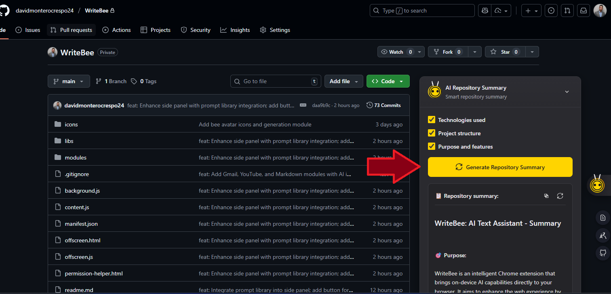

# WriteBee - On-Device AI Assistant for Chrome 🐝

<div align="center">

[](https://www.google.com/chrome/)
[](LICENSE)
[](manifest.json)

**Transform your browsing experience with powerful on-device AI capabilities**

[Features](#-features) • [Installation](#-installation) • [Usage](#-usage) • [Technology](#-technology-stack) • [Contributing](#-contributing)

</div>

---

## 📋 Overview

WriteBee is an advanced Chrome extension that brings cutting-edge AI capabilities directly to your browser using Chrome's built-in AI APIs. Process text, analyze images, transcribe audio, chat with web pages and PDFs - all running locally on your device with complete privacy.


---

## ✨ Features

### 🤖 AI-Powered Text Processing

Transform any text on the web with intelligent AI actions:

- **Summarize** - Generate concise summaries from lengthy content using hierarchical chunking
- **Translate** - Multi-language translation with automatic language detection
- **Rewrite** - Improve clarity and professionalism of your text
- **Explain** - Get clear explanations of complex concepts
- **Grammar Check** - Fix grammar and spelling errors
- **Expand Text** - Add details, examples, and depth to your writing
- **Generate Text** - AI-powered content creation in editable fields


### 🎙️ Audio & Voice Processing


- **Voice Input** - Record audio directly in the browser
- **Transcription** - Convert speech to text with high accuracy
- **Audio Summarization** - Get summaries of spoken content
- **Multi-format Support** - Works with various audio formats (WebM, MP3)

### 🖼️ Image Understanding & OCR


WriteBee can analyze and extract information from images:

- **Image Description** - Get detailed descriptions of images
- **OCR (Text Extraction)** - Extract text from images and screenshots
- **Explain Images** - Understand complex diagrams and visual content
- **Context-Aware Actions** - Floating action buttons on medium/large images


### 🎯 Platform-Specific Integrations

WriteBee integrates seamlessly with popular platforms to enhance your workflow:

#### 📺 YouTube


- **Automatic Video Summarization** - Get instant summaries of any video with captions
- **Hierarchical Chunking** - Efficiently process videos of any length
- **Progress Tracking** - Visual feedback during summarization
- **Copy & Regenerate** - Easily copy or regenerate summaries

#### 📧 Gmail

<table>
  <tr>
    <td></td>
    <td></td>
    <td></td>
  </tr>
</table>

- **Smart Composition** - AI-powered email writing assistance
- **Quick Reply Suggestions** - Generate appropriate responses instantly
- **Email Summarization** - Get the key points from long email threads
- **Professional Tone** - Adjust writing style for business communication

#### 🐦 Twitter / X


- **Tweet Composition** - Craft engaging tweets with AI assistance
- **Thread Summarization** - Understand long Twitter threads quickly
- **Engagement Optimization** - Improve tweet impact and reach

#### 💼 LinkedIn

<table>
  <tr>
    <td></td>
    <td></td>
    <td></td>
  </tr>
</table>

- **Professional Content** - Create polished LinkedIn posts and articles
- **Comment Assistance** - Generate thoughtful, professional comments
- **Template Library** - Access pre-built templates for common scenarios
- **Message Drafting** - Compose effective professional messages

#### 🐙 GitHub



- **Repository Summary** - Quickly understand any GitHub repository
- **Documentation Help** - Generate and improve documentation
- **Issue & PR Analysis** - Summarize issues and pull requests
- **Code Context** - Better understanding of code discussions

#### 🔍 Google Search


- **Search Result Summarization** - Get quick overviews of search results
- **Content Analysis** - Deeper understanding of web pages
- **Research Assistant** - Compile information from multiple sources

#### 📄 PDF Support with RAG


Advanced PDF processing using Retrieval-Augmented Generation (RAG):

- **PDF Text Extraction** - Extract text using multiple methods (PDF.js, regex, FileReader)
- **Chat with PDFs** - Ask questions and get accurate answers from PDF content
- **Smart Indexing** - Automatic chunking and vectorization for efficient retrieval
- **Multi-language Support** - Works with PDFs in multiple languages
- **Summarization** - Generate comprehensive summaries of PDF documents
- **Key Points Extraction** - Get bullet-point summaries of important information

### 💬 Intelligent Chat & Web Analysis


**Chat with Any Webpage or PDF** using advanced RAG (Retrieval-Augmented Generation):

- **Web Page Chat** - Ask questions about current page content
- **RAG Engine** - Smart retrieval with TF-IDF vectorization and hybrid scoring
- **Multi-language** - Support for Spanish, English, French, German, Italian, Portuguese
- **Link Analysis** - Automatically indexes relevant linked pages
- **Context Building** - Intelligent chunking (300 words with 50-word overlap)


### 🎨 User Interface

- **Floating Toolbar** - Context-aware AI actions appear when you select text
- **Side Panel Chat** - Full-featured AI chat interface with conversation history
- **Prompt Library** - Pre-built and custom prompt templates for common tasks
- **Context Menus** - Right-click AI actions for images and text
- **Markdown Support** - Beautiful formatted output with code highlighting
- **Language Options** - Customize output language for translations


---

## 🚀 Installation

### System Requirements

| Requirement | Specification |
|------------|---------------|
| **Browser** | Chrome 138+ (Canary/Dev recommended) |
| **Operating System** | Windows 10/11, macOS 13+, Linux, ChromeOS (Chromebook Plus) |
| **Storage** | 22+ GB free space (for Gemini Nano model) |
| **Memory (GPU)** | 4+ GB VRAM recommended |
| **Memory (CPU)** | 16+ GB RAM, 4+ cores |
| **Network** | Unlimited/unmetered connection for initial download |

### Quick Start

1. **Clone the Repository**
   ```bash
   git clone https://github.com/yourusername/writebee.git
   cd writebee
   ```

2. **Enable Chrome AI Features**
   - Navigate to `chrome://flags/#optimization-guide-on-device-model`
   - Set to **Enabled BypassPerfRequirement**
   - Navigate to `chrome://flags/#prompt-api-for-gemini-nano`
   - Set to **Enabled**
   - Restart Chrome

3. **Load the Extension**
   - Open `chrome://extensions/`
   - Enable **Developer mode** (toggle in top right)
   - Click **Load unpacked**
   - Select the `WriteBee` folder

4. **Initialize AI Model**
   - The extension will download Gemini Nano on first use
   - Monitor progress at `chrome://on-device-internals`
   - Wait for model download to complete (may take 10-30 minutes)
   - Once ready, you'll see "Model downloaded" status

5. **Start Using WriteBee**
   - Select any text on a webpage to see the floating toolbar
   - Click the extension icon to open the side panel
   - Right-click images for AI-powered image actions

---


### Advanced Features

#### RAG Engine (Retrieval-Augmented Generation)

- **TF-IDF Vectorization** - Efficient text indexing and retrieval
- **Hybrid Scoring** - Combines semantic similarity (60%) + keyword matching (40%)
- **Smart Chunking** - 300-word chunks with 50-word overlap for context preservation
- **Multi-language Stop Words** - Support for 6 languages
- **URL Relevance Scoring** - Intelligent link analysis and indexing

#### PDF Processing

- **Multi-method Extraction** - PDF.js, regex patterns, FileReader fallbacks
- **RAG Integration** - Chat with PDFs using vectorized search
- **Hierarchical Summarization** - Efficient processing of large documents


### Core Technologies

- **Vanilla JavaScript (ES6+)** - No frameworks, fast and lightweight
- **Chrome Extension Manifest V3** - Latest extension architecture
- **PDF.js** - Client-side PDF text extraction
- **DOMParser** - XML/HTML processing
- **Markdown Rendering** - Beautiful formatted output

---

## 📖 Usage Guide

### 1. Text Selection & Processing

**Quick Actions for Selected Text:**

1. **Select any text** on a webpage
2. **Floating toolbar appears** automatically with contextual actions
3. **Choose an action**: Summarize, Translate, Rewrite, Explain, etc.
4. **View results** instantly in the side panel with markdown formatting

### 2. Side Panel Chat


**Full-Featured AI Assistant:**

- **Open**: Click the WriteBee extension icon or use keyboard shortcut
- **Chat**: Type questions or requests in natural language
- **Context**: Conversations maintain context for follow-up questions
- **History**: Access previous conversations
- **Suggestions**: Quick action buttons for common tasks

**Available Actions:**
- Chat with current page
- Summarize page
- Upload and chat with PDF
- Ask general questions
- Use prompt templates

### 3. Chat with Web Pages


**Ask Questions About Any Webpage:**

1. Navigate to any webpage
2. Open side panel chat
3. Click **"Chat with this page"** or ask directly
4. Get accurate answers based on page content
5. Follow up with additional questions

**Features:**
- Automatic page indexing using RAG
- Relevant link discovery and analysis
- Multi-source context building
- Semantic search with keyword matching

### 4. PDF Chat & Analysis


**Upload and Interact with PDFs:**

1. Open side panel
2. Click the **PDF upload** button
3. Select your PDF file
4. Wait for processing and indexing
5. Ask questions about the PDF content

**Capabilities:**
- Extract text from any PDF (even complex layouts)
- Summarize entire documents
- Extract key points
- Answer specific questions
- Translate PDF content

### 5. YouTube Video Summaries


**Get Instant Video Summaries:**

1. Open any YouTube video with captions
2. Summary panel appears automatically
3. Click **"Video Summary"** button
4. View hierarchical summary in markdown
5. Copy or regenerate as needed

**Features:**
- Automatic transcript extraction
- Hierarchical chunking for long videos
- Progress tracking during summarization
- Key points and timestamps

### 6. Image Actions


**AI-Powered Image Analysis:**

1. Hover over medium/large images
2. Click the **WriteBee action button** (appears on top-right)
3. Select action:
   - **Extract Text (OCR)** - Pull text from images
   - **Explain Image** - Get detailed explanations
   - **Describe Image** - Generate alt text and descriptions

**Context Menu:**
- Right-click any image → WriteBee actions
- Process screenshots and graphics
- Extract text from photos

### 7. Prompt Library

**Access Pre-built and Custom Prompts:**

1. Open side panel chat
2. Click the **library icon** (book) in input area
3. Browse categories:
   - **Text**: Summarize, Translate, Explain, Expand, Simplify
   - **Writing**: Professional tone, Casual tone, Email writing
   - **Formatting**: Bullet points, Structured output
   - **Custom**: Your saved prompts
4. Search prompts by keyword
5. Click to insert into chat

**Create Custom Prompts:**
- Click **"+ Add Custom Prompt"**
- Name your prompt
- Write the template (use variables like `{language}`)
- Save for future use
- Delete anytime with trash icon

### 8. Platform-Specific Features

**Gmail:**
- Compose emails with AI assistance
- Generate reply suggestions
- Summarize long email threads

**LinkedIn:**
- Write professional posts
- Generate thoughtful comments
- Use templates for common scenarios

**Twitter/X:**
- Craft engaging tweets
- Summarize threads
- Optimize for engagement

**GitHub:**
- Summarize repositories


**Google Search:**
- Summarize search results
- Compare information from multiple sources
- Extract key insights


---

## 🔧 Configuration & Customization

### Language Support


**Supported Languages for Translation:**

- English (en) • Spanish (es) • French (fr) • German (de)
- Italian (it) • Portuguese (pt) • Japanese (ja) • Chinese (zh)
- Korean (ko) • Russian (ru) • Arabic (ar) • Hindi (hi)
- And 100+ more languages via Chrome Translator API

**Automatic Language Detection** - WriteBee detects source language automatically

### Output Customization

**Summary Options:**
- **Length**: Short, Medium, Long
- **Type**: Key-points, TL;DR, Teaser, Headline
- **Format**: Markdown, Plain-text

**Translation Options:**
- Target language selection
- Preserve formatting
- Context-aware translation

**Writing Style:**
- Professional
- Casual
- Formal
- Creative

---

## 🎯 Advanced Features

### 1. Prompt Library System

A powerful system for reusable AI prompts:

**Features:**

- **Pre-built Templates** - Ready-to-use prompts for common tasks
- **Categorized Organization** - Prompts sorted by Text, Writing, Formatting
- **Custom Prompts** - Create and save your own reusable prompts
- **Search Functionality** - Quickly find prompts by keyword
- **Template Variables** - Use dynamic parameters like `{language}`, `{tone}`
- **Persistent Storage** - All prompts saved locally (Chrome Storage API)
- **Import/Export** - Share prompt collections with others
- **Beautiful UI** - Seamless integration with WriteBee's design

**Creating Custom Prompts:**

1. Open prompt library
2. Click "+ Add Custom Prompt"
3. Enter name and description
4. Write your prompt template
5. Use variables: `{text}`, `{language}`, `{style}`
6. Save and reuse anytime

### 2. RAG (Retrieval-Augmented Generation)

**How It Works:**

1. **Indexing Phase:**
   - Extract page content (text, links, metadata)
   - Split into 300-word chunks with 50-word overlap
   - Tokenize and remove stop words (6 languages)
   - Create TF-IDF vectors for each chunk
   - Build searchable index

2. **Retrieval Phase:**
   - User asks a question
   - Vectorize question using same method
   - Calculate hybrid similarity scores:
     - 60% semantic similarity (cosine distance)
     - 40% keyword matching (exact matches)
   - Rank and retrieve top-k relevant chunks
   - Build context from best matches

3. **Generation Phase:**
   - Combine retrieved chunks into context
   - Add question and instructions
   - Send to Chrome AI Prompt API
   - Stream response to user

**Benefits:**
- Accurate answers from large documents
- Efficient processing of PDFs and web pages
- Multi-language support
- Context preservation across chunks

### 3. Hierarchical Summarization

**For Long Content (YouTube videos, articles):**

**Standard Process (< 4000 chars):**
- Direct summarization using Summarizer API
- Fast and efficient

**Hierarchical Process (> 4000 chars):**

1. **Chunk Creation**
   - Split text into 4,000-character segments
   - Maintain sentence boundaries

2. **Local Summarization**
   - Generate TL;DR for each chunk
   - Preserve key information

3. **Aggregation**
   - Combine all chunk summaries
   - Remove duplicates

4. **Final Summary**
   - Generate comprehensive summary from aggregated content
   - Extract key points in markdown format

**Advantages:**
- Handle unlimited content length
- Preserve important details
- Maintain coherence across sections

### 4. Multi-method PDF Extraction

**Fallback Chain for Maximum Compatibility:**

```
1. PDF.js (Primary)
   ├─→ Full text extraction with layout preservation
   ├─→ Page-by-page processing
   └─→ High accuracy

2. Regex Extraction (Secondary)
   ├─→ Pattern matching for PDF text objects
   ├─→ Decode escape sequences
   └─→ Filter noise

3. FileReader (Tertiary)
   ├─→ Binary content analysis
   ├─→ Text stream extraction
   └─→ Basic fallback

4. AI Vision (Last Resort)
   ├─→ Convert PDF pages to images
   ├─→ Use Multimodal API for OCR
   └─→ Extract text from rendered pages
```

**Result:** 95%+ success rate across all PDF types

### 5. Image Understanding Pipeline

**Multimodal AI Processing:**

1. **Image Analysis**
   - Automatic image detection (>200px threshold)
   - Floating action buttons on hover
   - Context menu integration

2. **AI Processing**
   - Vision model initialization
   - Image vectorization
   - Prompt-based analysis

3. **Actions Available**
   - **OCR**: Extract text with high accuracy
   - **Description**: Generate alt text and detailed descriptions
   - **Explanation**: Understand complex diagrams
   - **Translation**: Translate text within images

### 6. Smart Context Management

**Intelligent Text Processing:**

- **Whitespace Normalization** - Remove excessive spacing
- **Language Detection** - Auto-detect source language
- **Context-Aware Summarization** - Adjust based on content type
- **Duplicate Removal** - Eliminate redundant information
- **Markdown Formatting** - Beautiful output rendering
- **Code Highlighting** - Syntax highlighting in responses


## 🔄 Version History

### Version 1.2 (Current)

**New Features:**
- ✅ Integrated Prompt Library in side panel
- ✅ Pre-built prompt templates for common tasks
- ✅ Custom prompt creation and management
- ✅ Advanced search and categorization
- ✅ WriteBee-themed UI with yellow gradient design
- ✅ Image action buttons with floating menu
- ✅ Enhanced context menu for images

**Improvements:**
- ✅ Better error handling and user feedback
- ✅ Optimized token usage in prompts
- ✅ Improved markdown rendering

### Version 1.1

**New Features:**
- ✅ RAG (Retrieval-Augmented Generation) engine
- ✅ Chat with web pages functionality
- ✅ PDF upload and chat capability
- ✅ Multimodal API integration (image + audio)
- ✅ Audio recording and transcription
- ✅ Automatic YouTube video summarization
- ✅ Hierarchical text chunking for large content

**Improvements:**
- ✅ Direct API integration with youtranscripts.com
- ✅ Performance optimizations for large documents
- ✅ Enhanced UI/UX across all platforms

### Version 1.0 (Initial Release)

**Core Features:**
- ✅ Text processing (summarize, translate, rewrite, explain)
- ✅ Platform integrations (Gmail, LinkedIn, Twitter, GitHub)
- ✅ Floating toolbar for selected text
- ✅ Side panel chat interface
- ✅ Context menu actions
- ✅ Google Search integration

---

## 🗺️ Roadmap

### Planned Features

- [ ] **Multi-tab Chat** - Chat with content across multiple tabs
- [ ] **Web Search Integration** - Combine web search with AI responses
- [ ] **Voice Commands** - Control WriteBee with voice
- [ ] **Custom AI Models** - Support for other local models
- [ ] **Export Conversations** - Save chat history to file
- [ ] **Theme Customization** - Custom color schemes
- [ ] **Keyboard Shortcuts** - Configurable hotkeys
- [ ] **Batch Processing** - Process multiple files at once
- [ ] **API for Developers** - Extend WriteBee with plugins
- [ ] **Mobile Support** - Android Chrome support

### Under Consideration

- Integration with more platforms (Slack, Discord, Notion)
- Advanced PDF features (annotations, editing)
- Collaborative features (share prompts, summaries)
- Cloud sync (optional, privacy-preserving)
- Browser extension for Firefox/Edge

---

## 📄 License

```
MIT License

Copyright (c) 2025 WriteBee Contributors

Permission is hereby granted, free of charge, to any person obtaining a copy
of this software and associated documentation files (the "Software"), to deal
in the Software without restriction, including without limitation the rights
to use, copy, modify, merge, publish, distribute, sublicense, and/or sell
copies of the Software, and to permit persons to whom the Software is
furnished to do so, subject to the following conditions:

The above copyright notice and this permission notice shall be included in all
copies or substantial portions of the Software.

THE SOFTWARE IS PROVIDED "AS IS", WITHOUT WARRANTY OF ANY KIND, EXPRESS OR
IMPLIED, INCLUDING BUT NOT LIMITED TO THE WARRANTIES OF MERCHANTABILITY,
FITNESS FOR A PARTICULAR PURPOSE AND NONINFRINGEMENT. IN NO EVENT SHALL THE
AUTHORS OR COPYRIGHT HOLDERS BE LIABLE FOR ANY CLAIM, DAMAGES OR OTHER
LIABILITY, WHETHER IN AN ACTION OF CONTRACT, TORT OR OTHERWISE, ARISING FROM,
OUT OF OR IN CONNECTION WITH THE SOFTWARE OR THE USE OR OTHER DEALINGS IN THE
SOFTWARE.
```

---

## 🙏 Acknowledgments

We're grateful to the following projects and communities:

- **Chrome AI Team** - For pioneering on-device AI in browsers
- **Google Chrome** - For the powerful extension platform
- **PDF.js** - Mozilla's excellent PDF parsing library
- **YouTubeTranscripts** - For reliable transcript API
- **Open Source Community** - For inspiration and support
- **All Contributors** - Everyone who has helped improve WriteBee
- **Users** - For your feedback and feature requests

---

## 📧 Support & Contact

### Getting Help

- **Documentation**: Read this README thoroughly
- **Issues**: [Open an issue on GitHub](https://github.com/yourusername/writebee/issues)
- **Discussions**: [Join GitHub Discussions](https://github.com/yourusername/writebee/discussions)

### Reporting Bugs

When reporting bugs, please include:

1. Chrome version (`chrome://version`)
2. WriteBee version
3. Steps to reproduce
4. Expected vs actual behavior
5. Console errors (F12 → Console)
6. Screenshots if applicable

### Feature Requests

We love hearing your ideas! Open an issue with:

- Clear description of the feature
- Use case and benefits
- Proposed implementation (if technical)
- Examples from other tools

### Contact

- **Email**: [your-email@example.com]
- **GitHub**: [@yourusername](https://github.com/yourusername)
- **Twitter**: [@writebee_ai](https://twitter.com/writebee_ai)

---

## ⭐ Show Your Support

If you find WriteBee helpful, please:

- ⭐ Star this repository
- 🐛 Report bugs and request features
- 🔀 Fork and contribute
- 📢 Share with others
- 💬 Leave feedback

---

<div align="center">

**Made with ❤️ by the WriteBee Team**

[GitHub](https://github.com/yourusername/writebee) • [Documentation](https://github.com/yourusername/writebee#readme) • [Issues](https://github.com/yourusername/writebee/issues) • [Discussions](https://github.com/yourusername/writebee/discussions)

</div>

---

## 🔍 Keywords

Chrome Extension, AI Assistant, On-Device AI, Gemini Nano, Text Processing, Summarization, Translation, OCR, PDF Chat, RAG, Retrieval-Augmented Generation, YouTube Summarizer, Gmail Assistant, LinkedIn Helper, GitHub Integration, Web Chat, Privacy-Focused, Local AI, Browser AI, Productivity Tool, Writing Assistant, Content Generation, Image Analysis, Audio Transcription, Multimodal AI

---

**Important Notice**: This extension requires Chrome 138+ with Chrome AI features enabled. Features and performance may vary based on system specifications and available resources. The AI model (Gemini Nano) requires approximately 22GB of storage space for initial download.

