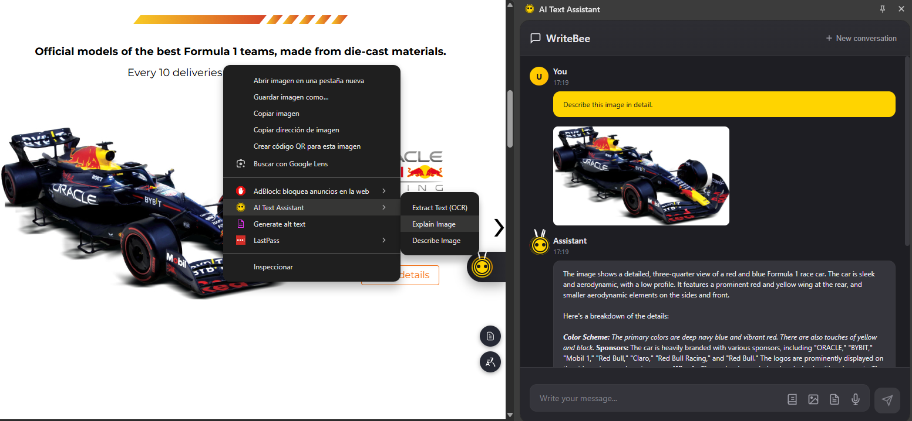

# WriteBee - On-Device AI Assistant for Chrome 🐝

<div align="center">

[](https://www.google.com/chrome/)
[](LICENSE)
[](manifest.json)

**Transform your browsing experience with powerful on-device AI capabilities**

[Features](#-features) • [Installation](#-installation) • [Usage](#-usage) • [Technology](#-technology-stack) • [Contributing](#-contributing)

</div>

---

## 📋 Overview

WriteBee is an advanced Chrome extension that brings cutting-edge AI capabilities directly to your browser using Chrome's built-in AI APIs. Process text, analyze images, transcribe audio, chat with web pages and PDFs - all running locally on your device with complete privacy.

<div align="center">
  
  <br/><em>WriteBee Floating Toolbar with AI Actions</em>
</div>

---

## ✨ Features

### 🤖 AI-Powered Text Processing

Transform any text on the web with intelligent AI actions:

- **Summarize** - Generate concise summaries from lengthy content using hierarchical chunking
- **Translate** - Multi-language translation with automatic language detection
- **Rewrite** - Improve clarity and professionalism of your text
- **Explain** - Get clear explanations of complex concepts
- **Grammar Check** - Advanced grammar and spelling correction using Chrome's Proofreader API
  - Real-time error detection with colored underlines
  - Click-to-fix suggestions with explanations
  - Replace All button to apply corrections instantly
  - Detailed error statistics and grouped corrections
- **Expand Text** - Add details, examples, and depth to your writing
- **Generate Text** - AI-powered content creation in editable fields

### 🎙️ Audio & Voice Processing

<div align="center">
  
  <br/><em>Voice Recording & Transcription Interface</em>
</div>

- **Voice Input** - Record audio directly in the browser
- **Transcription** - Convert speech to text with high accuracy
- **Audio Summarization** - Get summaries of spoken content
- **Multi-format Support** - Works with various audio formats (WebM, MP3)

### 🖼️ Image Understanding & OCR

<div align="center">
  
  <br/><em>AI Image Analysis & Text Extraction</em>
</div>

WriteBee can analyze and extract information from images:

- **Image Description** - Get detailed descriptions of images
- **OCR (Text Extraction)** - Extract text from images and screenshots
- **Explain Images** - Understand complex diagrams and visual content
- **Context-Aware Actions** - Floating action buttons on medium/large images

<div align="center">
  
  <br/><em>Detailed Image Description & OCR Results</em>
</div>

### 🎯 Platform-Specific Integrations

WriteBee integrates seamlessly with popular platforms to enhance your workflow:

#### 📺 YouTube

<div align="center">
  
  <br/><em>Automatic Video Summarization Panel</em>
</div>

- **Automatic Video Summarization** - Get instant summaries of any video with captions
- **Hierarchical Chunking** - Efficiently process videos of any length
- **Progress Tracking** - Visual feedback during summarization
- **Copy & Regenerate** - Easily copy or regenerate summaries

#### 📧 Gmail & Outlook

<table>
  <tr>
    <td align="center">
      
      <br/><em>Gmail AI Email Composer</em>
    </td>
    <td align="center">
      
      <br/><em>Outlook AI Email Composer</em>
    </td>
    <td align="center">
      
      <br/><em>15+ Professional Templates</em>
    </td>
  </tr>
  <tr>
    <td align="center">
      
      <br/><em>Generated Email Content</em>
    </td>
    <td align="center">
      
      <br/><em>Gmail Compose Integration</em>
    </td>
    <td align="center">
      
      <br/><em>Email Summary & Analysis</em>
    </td>
  </tr>
</table>

**AI Email Composer with Templates:**
- **15+ Professional Templates** - Pre-built templates for common email scenarios:
  - Professional Business Email
  - Follow-up Email
  - Thank You Email
  - Introduction Email
  - Team Member Introduction
  - Meeting Request
  - Feedback Email
  - Apology Email
  - Announcement Email
  - Request Email
  - Proposal Email
  - Reminder Email
  - Congratulations Email
  - Welcome Email
  - Status Update Email
- **Smart Template Tips** - Contextual advice for each template type
- **Customizable Options** - Control Length, Formality, Format, and Tone
- **Real-time Streaming** - Watch your email being generated progressively
- **Multi-language Support** - Generate emails in English, Spanish, French, German, Portuguese, and Italian
- **Quick Actions** - Insert into Gmail, Copy, or Regenerate with one click
- **Email Summarization** - Get the key points from long email threads
- **Smart Reply Suggestions** - Generate appropriate responses instantly

#### 🐦 Twitter / X

<div align="center">
  
  <br/><em>Tweet Composition & Thread Analysis</em>
</div>

- **Tweet Composition** - Craft engaging tweets with AI assistance
- **Thread Summarization** - Understand long Twitter threads quickly
- **Engagement Optimization** - Improve tweet impact and reach

#### 💼 LinkedIn

<table>
  <tr>
    <td align="center">
      
      <br/><em>Professional Post Creation</em>
    </td>
    <td align="center">
      
      <br/><em>Comment Assistant</em>
    </td>
    <td align="center">
      
      <br/><em>Template Library</em>
    </td>
  </tr>
</table>

- **Professional Content** - Create polished LinkedIn posts and articles
- **Comment Assistance** - Generate thoughtful, professional comments
- **Template Library** - Access pre-built templates for common scenarios
- **Message Drafting** - Compose effective professional messages

#### 🐙 GitHub

<div align="center">
  
  <br/><em>Repository Analysis & Code Understanding</em>
</div>

- **Repository Summary** - Quickly understand any GitHub repository
- **Documentation Help** - Generate and improve documentation
- **Issue & PR Analysis** - Summarize issues and pull requests
- **Code Context** - Better understanding of code discussions

#### 🔍 Google Search

<div align="center">
  
  <br/><em>Search Result Summarization & Analysis</em>
</div>

- **Search Result Summarization** - Get quick overviews of search results
- **Content Analysis** - Deeper understanding of web pages
- **Research Assistant** - Compile information from multiple sources

#### 📄 PDF Support with RAG

<div align="center">
  
  <br/><em>PDF Chat with RAG-Powered Question Answering</em>
</div>

Advanced PDF processing using Retrieval-Augmented Generation (RAG):

- **PDF Text Extraction** - Extract text using multiple methods (PDF.js, regex, FileReader)
- **Chat with PDFs** - Ask questions and get accurate answers from PDF content
- **Smart Indexing** - Automatic chunking and vectorization for efficient retrieval
- **Multi-language Support** - Works with PDFs in multiple languages
- **Summarization** - Generate comprehensive summaries of PDF documents
- **Key Points Extraction** - Get bullet-point summaries of important information

### 💬 Intelligent Chat & Web Analysis

<div align="center">
  
  <br/><em>Interactive Page Chat with Context-Aware Responses</em>
</div>

**Chat with Any Webpage or PDF** using advanced RAG (Retrieval-Augmented Generation):

- **Web Page Chat** - Ask questions about current page content
- **RAG Engine** - Smart retrieval with TF-IDF vectorization and hybrid scoring
- **Multi-language** - Support for Spanish, English, French, German, Italian, Portuguese
- **Link Analysis** - Automatically indexes relevant linked pages
- **Context Building** - Intelligent chunking (300 words with 50-word overlap)

<div align="center">
  
  <br/><em>Side Panel AI Assistant with Conversation History</em>
</div>

### 🎨 User Interface

- **Floating Toolbar** - Context-aware AI actions appear when you select text
- **Side Panel Chat** - Full-featured AI chat interface with conversation history
- **Prompt Library** - Pre-built and custom prompt templates for common tasks
- **Context Menus** - Right-click AI actions for images and text
- **Markdown Support** - Beautiful formatted output with code highlighting
- **Language Options** - Customize output language for translations

<div align="center">
  
  <br/><em>Multi-Language Translation Options</em>
</div>

---

## 🚀 Installation

### System Requirements

| Requirement | Specification |
|------------|---------------|
| **Browser** | Chrome 138+ (Canary/Dev recommended) |
| **Operating System** | Windows 10/11, macOS 13+, Linux, ChromeOS (Chromebook Plus) |
| **Storage** | 22+ GB free space (for Gemini Nano model) |
| **Memory (GPU)** | 4+ GB VRAM recommended |
| **Memory (CPU)** | 16+ GB RAM, 4+ cores |
| **Network** | Unlimited/unmetered connection for initial download |

### Quick Start

1. **Clone the Repository**
   ```bash
   git clone https://github.com/yourusername/writebee.git
   cd writebee
   ```

2. **Enable Chrome AI Features**
   - Navigate to `chrome://flags/#optimization-guide-on-device-model`
   - Set to **Enabled BypassPerfRequirement**
   - Navigate to `chrome://flags/#prompt-api-for-gemini-nano`
   - Set to **Enabled**
   - Restart Chrome

3. **Load the Extension**
   - Open `chrome://extensions/`
   - Enable **Developer mode** (toggle in top right)
   - Click **Load unpacked**
   - Select the `WriteBee` folder

4. **Initialize AI Model**
   - The extension will download Gemini Nano on first use
   - Monitor progress at `chrome://on-device-internals`
   - Wait for model download to complete (may take 10-30 minutes)
   - Once ready, you'll see "Model downloaded" status

5. **Start Using WriteBee**
   - Select any text on a webpage to see the floating toolbar
   - Click the extension icon to open the side panel
   - Right-click images for AI-powered image actions

---


### Advanced Features

#### RAG Engine (Retrieval-Augmented Generation)

- **TF-IDF Vectorization** - Efficient text indexing and retrieval
- **Hybrid Scoring** - Combines semantic similarity (60%) + keyword matching (40%)
- **Smart Chunking** - 300-word chunks with 50-word overlap for context preservation
- **Multi-language Stop Words** - Support for 6 languages
- **URL Relevance Scoring** - Intelligent link analysis and indexing

#### PDF Processing

- **Multi-method Extraction** - PDF.js, regex patterns, FileReader fallbacks
- **RAG Integration** - Chat with PDFs using vectorized search
- **Hierarchical Summarization** - Efficient processing of large documents


### Core Technologies

- **Vanilla JavaScript (ES6+)** - No frameworks, fast and lightweight
- **Chrome Extension Manifest V3** - Latest extension architecture
- **PDF.js** - Client-side PDF text extraction
- **DOMParser** - XML/HTML processing
- **Markdown Rendering** - Beautiful formatted output

---

## 📖 Usage Guide

### 1. Text Selection & Processing

**Quick Actions for Selected Text:**

1. **Select any text** on a webpage
2. **Floating toolbar appears** automatically with contextual actions
3. **Choose an action**: Summarize, Translate, Rewrite, Explain, Grammar Check, etc.
4. **View results** instantly in the side panel with markdown formatting

**Grammar Check - Advanced Error Correction:**

WriteBee includes a powerful grammar checker powered by Chrome's on-device Proofreader API:

1. **Basic Usage:**
   - Select text containing grammar or spelling errors
   - Click the **Grammar Check** button in the floating toolbar
   - View detailed corrections with error statistics

2. **Features:**
   - **Error Types Detected**: Spelling, punctuation, capitalization, preposition errors, missing words, and general grammar issues
   - **Compact Results**: Shows total errors found with a breakdown by type
   - **Corrected Text**: See the fully corrected version instantly
   - **Changes List**: Review all corrections made (shows first 10)
   - **Replace All**: One-click button to replace selected text with corrections

3. **Real-time Checking** (for input/textarea elements):
   - Type in any text field
   - Errors are highlighted with colored wavy underlines
   - Click on underlined text to see suggestions
   - Apply fixes individually or dismiss

4. **Replace All Button:**
   - Automatically replaces the original selected text with corrected version
   - Works in textareas, input fields, and contenteditable elements
   - Shows "Replaced!" confirmation when successful
   - Copies to clipboard as backup

**Note:** Grammar Check requires Chrome 141+ and an active Origin Trial for the Proofreader API. Currently supports English language.

### 2. Side Panel Chat

**Full-Featured AI Assistant:**

- **Open**: Click the WriteBee extension icon or use keyboard shortcut
- **Chat**: Type questions or requests in natural language
- **Context**: Conversations maintain context for follow-up questions
- **History**: Access previous conversations
- **Suggestions**: Quick action buttons for common tasks

**Available Actions:**
- Chat with current page
- Summarize page
- Upload and chat with PDF
- Ask general questions
- Use prompt templates

### 3. Chat with Web Pages

**Ask Questions About Any Webpage:**

1. Navigate to any webpage
2. Open side panel chat
3. Click **"Chat with this page"** or ask directly
4. Get accurate answers based on page content
5. Follow up with additional questions

**Features:**
- Automatic page indexing using RAG
- Relevant link discovery and analysis
- Multi-source context building
- Semantic search with keyword matching

### 4. PDF Chat & Analysis

**Upload and Interact with PDFs:**

1. Open side panel
2. Click the **PDF upload** button
3. Select your PDF file
4. Wait for processing and indexing
5. Ask questions about the PDF content

**Capabilities:**
- Extract text from any PDF (even complex layouts)
- Summarize entire documents
- Extract key points
- Answer specific questions
- Translate PDF content

### 5. YouTube Video Summaries

**Get Instant Video Summaries:**

1. Open any YouTube video with captions
2. Summary panel appears automatically
3. Click **"Video Summary"** button
4. View hierarchical summary in markdown
5. Copy or regenerate as needed

**Features:**
- Automatic transcript extraction
- Hierarchical chunking for long videos
- Progress tracking during summarization
- Key points and timestamps

### 6. Image Actions

**AI-Powered Image Analysis:**

1. Hover over medium/large images
2. Click the **WriteBee action button** (appears on top-right)
3. Select action:
   - **Extract Text (OCR)** - Pull text from images
   - **Explain Image** - Get detailed explanations
   - **Describe Image** - Generate alt text and descriptions

**Context Menu:**
- Right-click any image → WriteBee actions
- Process screenshots and graphics
- Extract text from photos

### 7. Prompt Library

**Access Pre-built and Custom Prompts:**

1. Open side panel chat
2. Click the **library icon** (book) in input area
3. Browse categories:
   - **Text**: Summarize, Translate, Explain, Expand, Simplify
   - **Writing**: Professional tone, Casual tone, Email writing
   - **Formatting**: Bullet points, Structured output
   - **Custom**: Your saved prompts
4. Search prompts by keyword
5. Click to insert into chat

**Create Custom Prompts:**
- Click **"+ Add Custom Prompt"**
- Name your prompt
- Write the template (use variables like `{language}`)
- Save for future use
- Delete anytime with trash icon

### 8. Platform-Specific Features

**Gmail & Outlook - AI Email Composer:**

1. **Access the Composer:**
   - **Gmail**: Open Gmail and click "Compose" → Look for the **"AI WriteBee"** button in the compose toolbar
   - **Outlook**: Open Outlook and click "New email" → Look for the **"AI WriteBee"** button next to the Discard button
   - Click it to open the AI Email Composer dialog

2. **Choose a Template:**
   - Click the template dropdown to see 15+ professional email templates
   - Select a template that matches your email purpose
   - View helpful tips for each template type

3. **Describe Your Email:**
   - Write a brief description of what you want to say
   - Be specific about key points, recipients, or desired outcome
   - Keep it concise (the AI will expand it)

4. **Customize Options (Optional):**
   - Click the options button (sliders icon) to adjust:
     - **Length**: Auto, Short, Medium, Long
     - **Formality**: Auto, Informal, Neutral, Formal
     - **Format**: Email, Message, Comment, etc.
     - **Tone**: Auto, Enthusiastic, Humorous, Professional, etc.
   - Select your preferred language

5. **Generate Email:**
   - Click the plane icon to generate
   - Watch the email being written in real-time (streaming)
   - Edit the generated content directly

6. **Insert or Copy:**
   - **Insert into Gmail/Outlook**: Automatically paste into compose window
   - **Copy**: Copy to clipboard for later use
   - **Regenerate**: Generate a new version with different wording

**LinkedIn:**
- Write professional posts
- Generate thoughtful comments
- Use templates for common scenarios

**Twitter/X:**
- Craft engaging tweets
- Summarize threads
- Optimize for engagement

**GitHub:**
- Summarize repositories

**Google Search:**
- Summarize search results
- Compare information from multiple sources
- Extract key insights


---

## 🔧 Configuration & Customization

### Language Support

**Supported Languages for Translation:**

- English (en) • Spanish (es) • French (fr) • German (de)
- Italian (it) • Portuguese (pt) • Japanese (ja) • Chinese (zh)
- Korean (ko) • Russian (ru) • Arabic (ar) • Hindi (hi)
- And 100+ more languages via Chrome Translator API

**Automatic Language Detection** - WriteBee detects source language automatically

### Output Customization

**Summary Options:**
- **Length**: Short, Medium, Long
- **Type**: Key-points, TL;DR, Teaser, Headline
- **Format**: Markdown, Plain-text

**Translation Options:**
- Target language selection
- Preserve formatting
- Context-aware translation

**Writing Style:**
- Professional
- Casual
- Formal
- Creative

---

## 🎯 Advanced Features

### 1. Prompt Library System

A powerful system for reusable AI prompts:

**Features:**

- **Pre-built Templates** - Ready-to-use prompts for common tasks
- **Categorized Organization** - Prompts sorted by Text, Writing, Formatting
- **Custom Prompts** - Create and save your own reusable prompts
- **Search Functionality** - Quickly find prompts by keyword
- **Template Variables** - Use dynamic parameters like `{language}`, `{tone}`
- **Persistent Storage** - All prompts saved locally (Chrome Storage API)
- **Import/Export** - Share prompt collections with others
- **Beautiful UI** - Seamless integration with WriteBee's design

**Creating Custom Prompts:**

1. Open prompt library
2. Click "+ Add Custom Prompt"
3. Enter name and description
4. Write your prompt template
5. Use variables: `{text}`, `{language}`, `{style}`
6. Save and reuse anytime

### 2. RAG (Retrieval-Augmented Generation)

**How It Works:**

1. **Indexing Phase:**
   - Extract page content (text, links, metadata)
   - Split into 300-word chunks with 50-word overlap
   - Tokenize and remove stop words (6 languages)
   - Create TF-IDF vectors for each chunk
   - Build searchable index

2. **Retrieval Phase:**
   - User asks a question
   - Vectorize question using same method
   - Calculate hybrid similarity scores:
     - 60% semantic similarity (cosine distance)
     - 40% keyword matching (exact matches)
   - Rank and retrieve top-k relevant chunks
   - Build context from best matches

3. **Generation Phase:**
   - Combine retrieved chunks into context
   - Add question and instructions
   - Send to Chrome AI Prompt API
   - Stream response to user

**Benefits:**
- Accurate answers from large documents
- Efficient processing of PDFs and web pages
- Multi-language support
- Context preservation across chunks

### 3. Hierarchical Summarization

**For Long Content (YouTube videos, articles):**

**Standard Process (< 4000 chars):**
- Direct summarization using Summarizer API
- Fast and efficient

**Hierarchical Process (> 4000 chars):**

1. **Chunk Creation**
   - Split text into 4,000-character segments
   - Maintain sentence boundaries

2. **Local Summarization**
   - Generate TL;DR for each chunk
   - Preserve key information

3. **Aggregation**
   - Combine all chunk summaries
   - Remove duplicates

4. **Final Summary**
   - Generate comprehensive summary from aggregated content
   - Extract key points in markdown format

**Advantages:**
- Handle unlimited content length
- Preserve important details
- Maintain coherence across sections

### 4. Multi-method PDF Extraction

**Fallback Chain for Maximum Compatibility:**

```
1. PDF.js (Primary)
   ├─→ Full text extraction with layout preservation
   ├─→ Page-by-page processing
   └─→ High accuracy

2. Regex Extraction (Secondary)
   ├─→ Pattern matching for PDF text objects
   ├─→ Decode escape sequences
   └─→ Filter noise

3. FileReader (Tertiary)
   ├─→ Binary content analysis
   ├─→ Text stream extraction
   └─→ Basic fallback

4. AI Vision (Last Resort)
   ├─→ Convert PDF pages to images
   ├─→ Use Multimodal API for OCR
   └─→ Extract text from rendered pages
```

**Result:** 95%+ success rate across all PDF types

### 5. Image Understanding Pipeline

**Multimodal AI Processing:**

1. **Image Analysis**
   - Automatic image detection (>200px threshold)
   - Floating action buttons on hover
   - Context menu integration

2. **AI Processing**
   - Vision model initialization
   - Image vectorization
   - Prompt-based analysis

3. **Actions Available**
   - **OCR**: Extract text with high accuracy
   - **Description**: Generate alt text and detailed descriptions
   - **Explanation**: Understand complex diagrams
   - **Translation**: Translate text within images

### 6. Smart Context Management

**Intelligent Text Processing:**

- **Whitespace Normalization** - Remove excessive spacing
- **Language Detection** - Auto-detect source language
- **Context-Aware Summarization** - Adjust based on content type
- **Duplicate Removal** - Eliminate redundant information
- **Markdown Formatting** - Beautiful output rendering
- **Code Highlighting** - Syntax highlighting in responses


## 🔄 Version History

### Version 1.2 (Current)

**New Features:**
- ✅ Integrated Prompt Library in side panel
- ✅ Pre-built prompt templates for common tasks
- ✅ Custom prompt creation and management
- ✅ Advanced search and categorization
- ✅ WriteBee-themed UI with yellow gradient design
- ✅ Image action buttons with floating menu
- ✅ Enhanced context menu for images

**Improvements:**
- ✅ Better error handling and user feedback
- ✅ Optimized token usage in prompts
- ✅ Improved markdown rendering

### Version 1.1

**New Features:**
- ✅ RAG (Retrieval-Augmented Generation) engine
- ✅ Chat with web pages functionality
- ✅ PDF upload and chat capability
- ✅ Multimodal API integration (image + audio)
- ✅ Audio recording and transcription
- ✅ Automatic YouTube video summarization
- ✅ Hierarchical text chunking for large content

**Improvements:**
- ✅ Direct API integration with youtranscripts.com
- ✅ Performance optimizations for large documents
- ✅ Enhanced UI/UX across all platforms

### Version 1.0 (Initial Release)

**Core Features:**
- ✅ Text processing (summarize, translate, rewrite, explain)
- ✅ Platform integrations (Gmail, LinkedIn, Twitter, GitHub)
- ✅ Floating toolbar for selected text
- ✅ Side panel chat interface
- ✅ Context menu actions
- ✅ Google Search integration

---


## 📄 License

```
MIT License

Copyright (c) 2025 WriteBee Contributors

Permission is hereby granted, free of charge, to any person obtaining a copy
of this software and associated documentation files (the "Software"), to deal
in the Software without restriction, including without limitation the rights
to use, copy, modify, merge, publish, distribute, sublicense, and/or sell
copies of the Software, and to permit persons to whom the Software is
furnished to do so, subject to the following conditions:

The above copyright notice and this permission notice shall be included in all
copies or substantial portions of the Software.

THE SOFTWARE IS PROVIDED "AS IS", WITHOUT WARRANTY OF ANY KIND, EXPRESS OR
IMPLIED, INCLUDING BUT NOT LIMITED TO THE WARRANTIES OF MERCHANTABILITY,
FITNESS FOR A PARTICULAR PURPOSE AND NONINFRINGEMENT. IN NO EVENT SHALL THE
AUTHORS OR COPYRIGHT HOLDERS BE LIABLE FOR ANY CLAIM, DAMAGES OR OTHER
LIABILITY, WHETHER IN AN ACTION OF CONTRACT, TORT OR OTHERWISE, ARISING FROM,
OUT OF OR IN CONNECTION WITH THE SOFTWARE OR THE USE OR OTHER DEALINGS IN THE
SOFTWARE.
```


